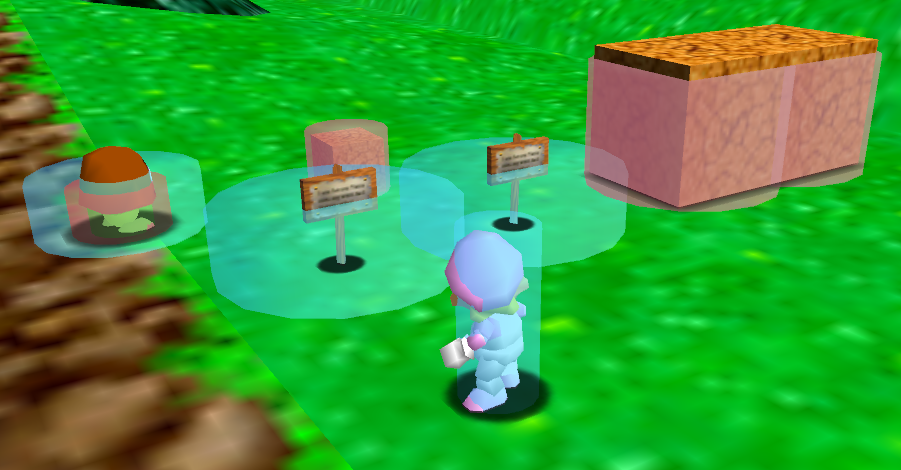
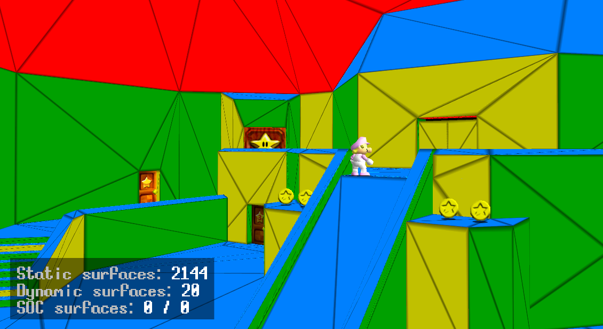
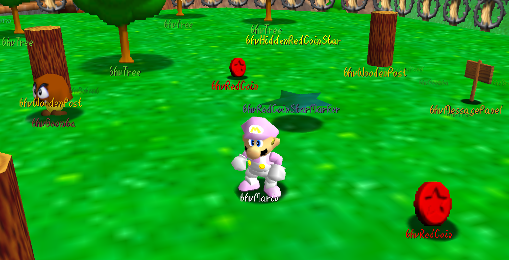
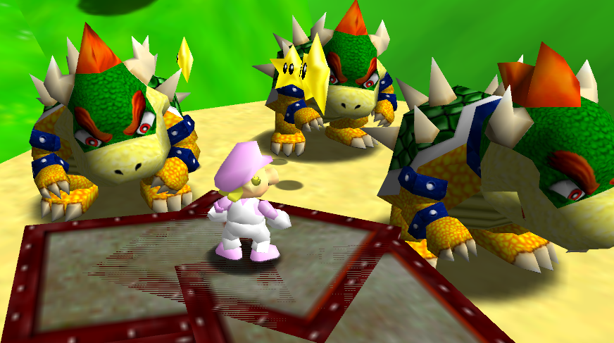
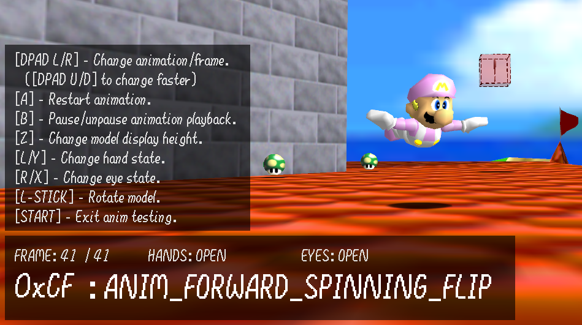

A repository made to centralize various resources and mods for [sm64coopdx](https://github.com/coop-deluxe/sm64coopdx) Lua modding and debugging.

<br>

# Debug and development

The following mods are a collection of tools to make debugging easier.
- **These mods are meant to be used during development, they shouldn't be used in public lobbies!**
- **This section includes standalone mods only, not libraries!**

<br>

## [King's Devtools](https://github.com/PeachyPeachSM64/coopdx-resources/tree/master/Debug%20and%20Development/kings-devtools)

Author: **King the memer**

> A multi-command tool that can display various Mario information, warp to any level, toggle cap power-ups and use `ACT_DEBUG_FREE_MOVE` to move around freely. 

Press <kbd>D ↑</kbd> to enter `ACT_DEBUG_FREE_MOVE`.<br>
Press <kbd>D ↓</kbd> to toggle display of Mario's position, velocity, angle and action.<br>
Press <kbd>D ←</kbd> to open the level select menu.<br>
Press <kbd>D →</kbd> to toggle the wing/vanish/metal cap.

<br>

## [No Clip](https://github.com/PeachyPeachSM64/coopdx-resources/blob/master/Debug%20and%20Development/noclip.lua)

Author: **AgentX**

> An improved version of `ACT_DEBUG_FREE_MOVE` that doesn't require the development build.<br>
> Allows Mario to walk freely through walls, floors, ceilings and out-of-bounds.

Enable No-clip mode by pressing <kbd>L</kbd> + <kbd>Z</kbd>.<br>
Hold <kbd>A</kbd> to move up, <kbd>Z</kbd> to move down, <kbd>B</kbd> to slow down.<br>
Press <kbd>L</kbd> to exit No-clip mode.

<br>

## [Hitbox Display](https://github.com/PeachyPeachSM64/coopdx-resources/tree/master/Debug%20and%20Development/debug-box)



Author: **PeachyPeach**

> Show objects hitboxes as semi-transparent cylinders.

Go to the mod menu to enable different boxes:
- Hitboxes (blue)
- Hurtboxes (red)
- Wallboxes (green)

<br>

## [Surface Display](https://github.com/PeachyPeachSM64/coopdx-resources/tree/master/Debug%20and%20Development/debug-surface)



Author: **PeachyPeach**

> Show level and object collisions as colored surfaces.<br>
> Floors are blue, ceilings are red, X-oriented walls are green and Z-oriented walls are yellow.

Go to the mod menu to enable different surfaces:
- Static surfaces (level geometry)
- Dynamic surfaces (objects)
- SOC surfaces (static object surfaces)

<br>

## [Behaviors on Screen](https://github.com/PeachyPeachSM64/coopdx-resources/blob/master/Debug%20and%20Development/behaviors-on-screen.lua)



Author: **Davimari**

> Show all objects their behavior next to them.

Go to the mod menu to toggle the display and color on behavior names.

<br>

## [Beard's Mod](https://github.com/PeachyPeachSM64/coopdx-resources/tree/master/Debug%20and%20Development/beards-mod)



Author: **BeardEnthusiast**

> A Garry's Mod like mod in SM64.<br>
> Allows to search or spawn almost any object at any location, with configurable parameters.

This mod uses chat commands:
- `spawn <object>`: Spawn an object.
  - Choose to spawn it synced or non-synced.
  - Use the left stick to move the object horizontally, use the <kbd>D</kbd> pad to rotate it, hold <kbd>A</kbd> to move up, <kbd>Z</kbd> to move down, press <kbd>B</kbd> to place the object. By pressing <kbd>L</kbd> while moving the object, you can also:
    - Teleport the object to Mario
    - Teleport Mario to the object
    - Reset the object rotation
    - Change the view
    - Cancel the spawning
- `custom <object> <model>`: Assign an object with a model to use as `spawn custom`.
- `params <behparam1> <behparam2> <behparam3> <behparam4> <behparam2ndbyte>`: Set the behavior params of the object to spawn.
- `speed <speed>`: Control the movement speed when placing an object.
- `distance <distance>`: Control the camera distance to the object to spawn.
- `search <name>`: Search an object, behavior or model name.
- `respawn`: Respawn Mario.

<br>

## [Anim Tester](https://github.com/PeachyPeachSM64/coopdx-resources/blob/master/Debug%20and%20Development/anim-tester.lua)



Author: **Wibblus**

> An animation tester and visualizer.

To enter the test state, press <kbd>Z</kbd> + <kbd>D ↓</kbd>.<br>
In this state, you can:
- Change the animation and frame using the <kbd>D</kbd> pad.
- Restart the animation by pressing <kbd>A</kbd>.
- Pause/unpause the animation playback by pressing <kbd>B</kbd>.
- Change the model display height by holding <kbd>Z</kbd>.
- Change the hand state by pressing <kbd>L</kbd> or <kbd>Y</kbd>.
- Change the eye state by pressing <kbd>R</kbd> or <kbd>X</kbd>.
- Rotate the model with the left stick.
- Exit the test state by pressing <kbd>Start</kbd>.

<br>

## [Deep Lua Profiling](https://github.com/PeachyPeachSM64/coopdx-resources/tree/master/Debug%20and%20Development/_PROFILER)

Author: **djoslin0**

> A deep Lua profiler that helps identify bottlenecks in Lua code.

To start a profiling session, press <kbd>L</kbd> + <kbd>D →</kbd>.<br>
Then, to stop the session, press <kbd>L</kbd> + <kbd>D ←</kbd>.<br>
A table similar to the following one will be shown in the terminal:<br>
```
 +-----+-------------------------------+-------------+-------------+-------------+-------------+--------+---------------------+
 | #   | Function                      | Calls       | Self        | Inclusive   | Avg/call    | %      | Source              |
 +-----+-------------------------------+-------------+-------------+-------------+-------------+--------+---------------------+
 | 1   | get_role_name_and_color       | 1462        | 180.00ms    | 18.00ms     | 123.1us     | 6.1%   | a-utils.lua:645     |
 | 2   | get_synced_timer_value        | 3526        | 142.00ms    | 5.00ms      | 40.3us      | 4.8%   | a-utils.lua:1051    |
 | 3   | handle_synced_timer           | 2752        | 136.00ms    | 5.00ms      | 49.4us      | 4.6%   | a-utils.lua:1006    |
 | 4   | get_crown_anim_state          | 1376        | 87.00ms     | 1.00ms      | 63.2us      | 3.0%   | crown.lua:137       |
 | 5   | know_team                     | 1634        | 72.00ms     | 0.0us       | 44.1us      | 2.4%   | a-utils.lua:698     |
 | 6   | treat_as_hunter               | 1462        | 67.00ms     | 4.00ms      | 45.8us      | 2.3%   | !mystery.lua:68     |
 | 7   | apply_double_health           | 1548        | 30.00ms     | 9.00ms      | 19.4us      | 1.0%   | b-utils.lua:682     |
 | 8   | get_setting_as_string         | 735         | 27.00ms     | 0.0us       | 36.7us      | 0.9%   | settings.lua:262    |
 | ... | ...                           | ...         | ...         | ...         | ...         | ...    | ...                 |
 +-----+-------------------------------+-------------+-------------+-------------+-------------+--------+---------------------+
```

> [!WARNING]  
> To use this mod, you need to build the game in development mode with the `LUA_UNSAFE` compiler flag (`make dev LUA_UNSAFE=1`) and run the game through a terminal using the `--console` command line option (`./sm64coopdx.exe --console`).
